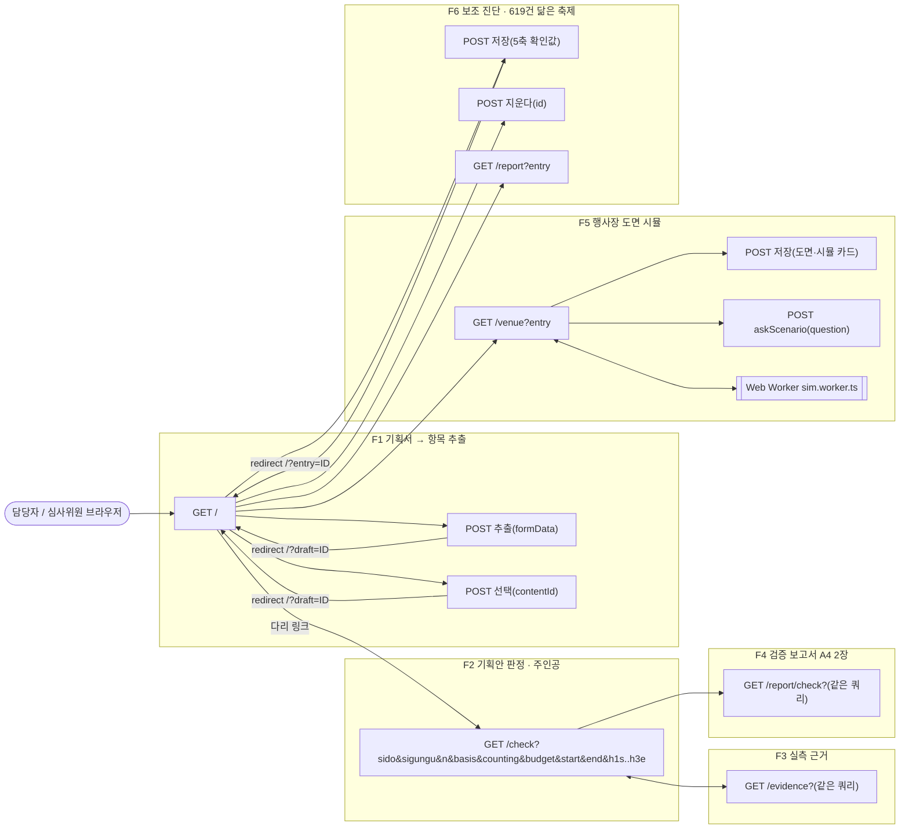
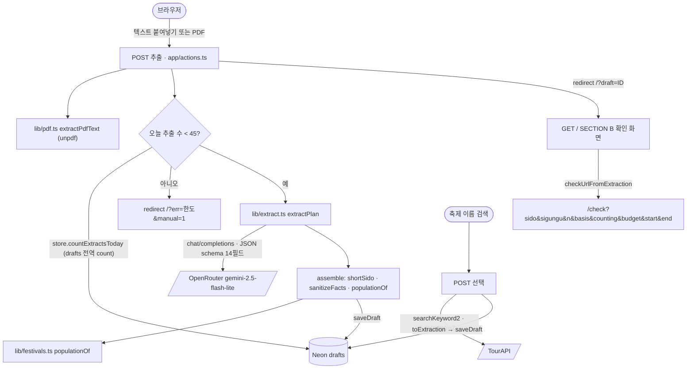
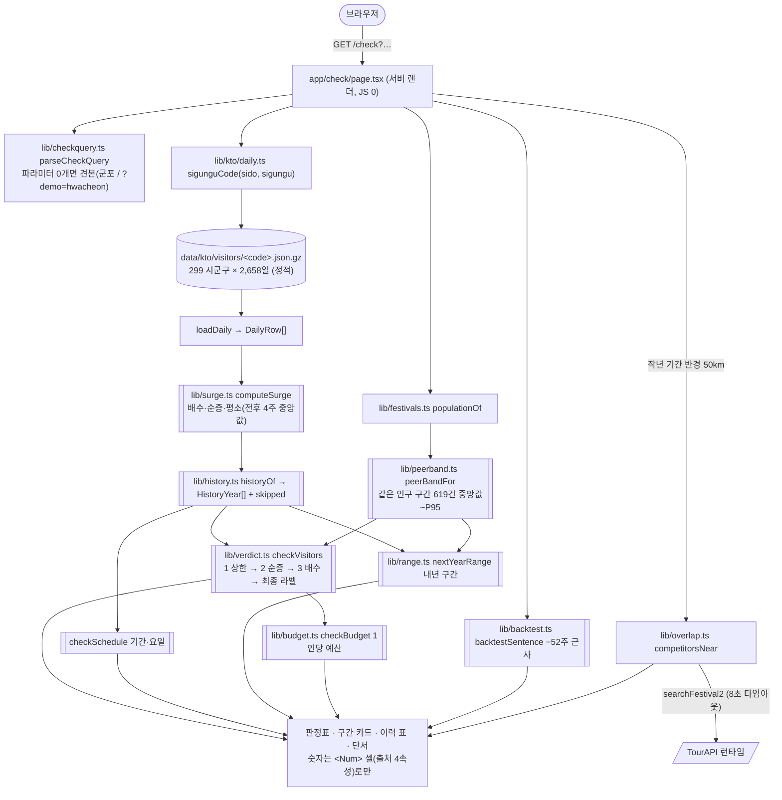
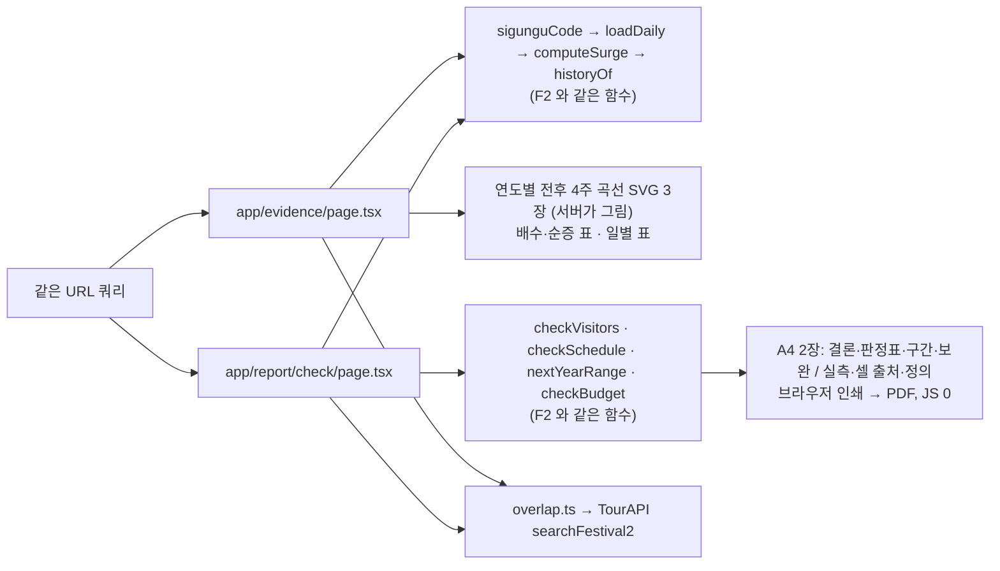
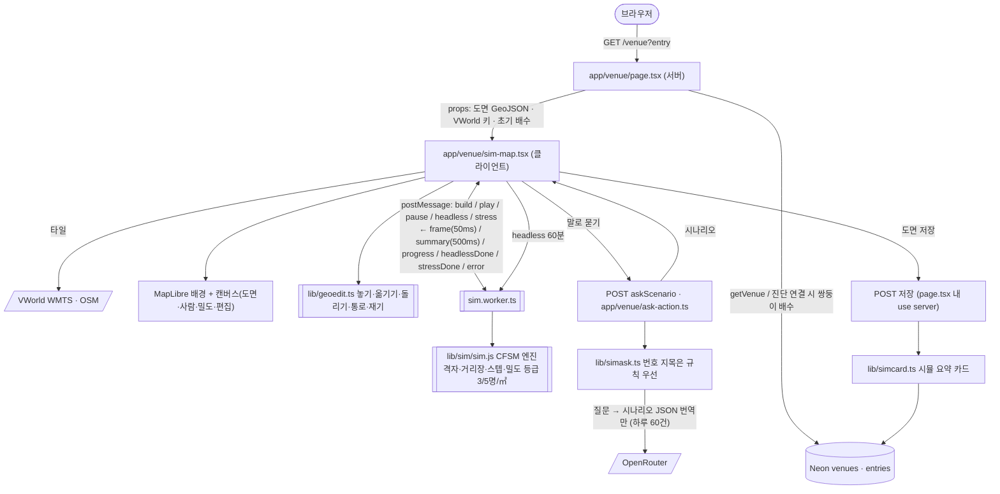
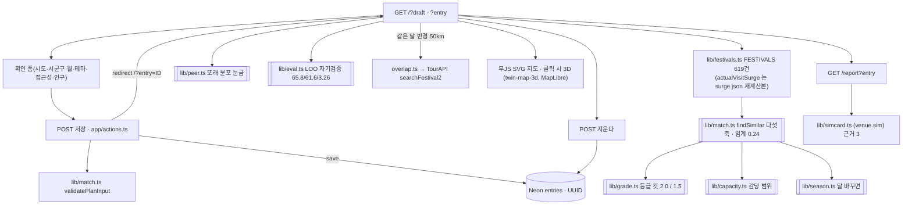
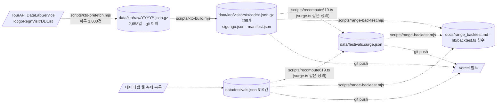
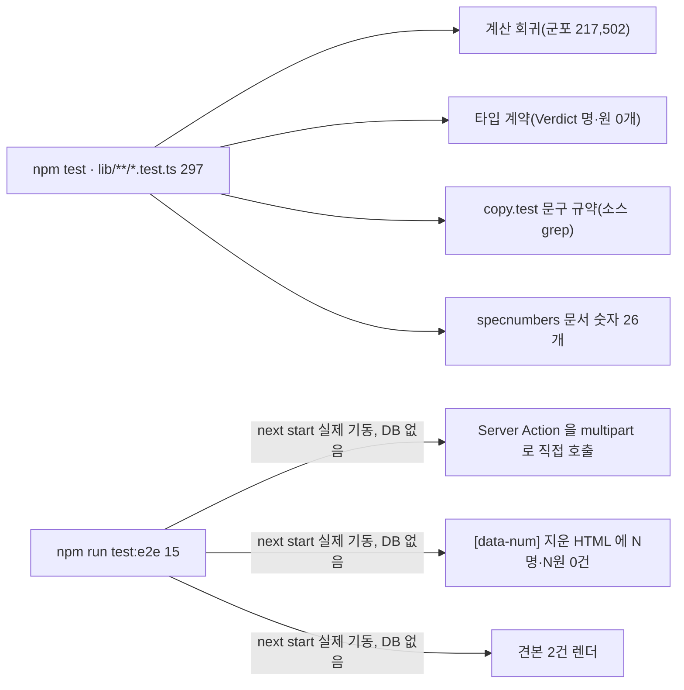

# 기능별 아키텍처 — 엔드포인트까지

> 엔드포인트는 셋 종류다. **페이지(GET)** 6개, **서버 액션(POST)** 6개, **워커 메시지**(브라우저 안). REST `/api/*` 라우트는 없다.
> 실선 = 요청 시 호출. 점선 = 빌드 전 1회. 굵은 테두리 = 순수 함수(외부 호출 0, 모델 0회).

## 0. 전체 지도 — 기능 6개와 그 아래 엔드포인트

## 1. F1 기획서 → 항목 추출 (모델을 부르는 유일한 곳)

## 2. F2 기획안 판정 `/check` (순수 함수 사슬)

## 3. F3 실측 근거 `/evidence` · F4 보고서 `/report/check`

## 4. F5 행사장 도면 시뮬 `/venue`

## 5. F6 보조 진단 `/` SECTION C · `/report`

## 6. F0 데이터 파이프라인 (빌드 전, 사람이 1회)

## 7. 외부 의존성 한 표

| 외부 | 어느 기능 | 언제 | 죽으면 |
|---|---|---|---|
| TourAPI `DataLabService/locgoRegnVisitrDDList` | F0 → F2·F3·F4 | 빌드 전만 | 영향 0 (파일) |
| TourAPI `searchFestival2` | F2·F3·F4·F6 귀속 경고 | 요청 시 | 경고만 "조회 실패", 판정 유지 |
| TourAPI `searchKeyword2`·`detail*2` | F1 축제 검색 | 요청 시 | 그 절 숨김 |
| OpenRouter (gemini-2.5-flash-lite) | F1 추출 · F5 질문 번역 | 버튼 때만 | 수동 입력 / 규칙 폴백 |
| VWorld · OSM 타일 | F5 · F6 3D | 브라우저 직접 | 화질만 |
| Neon Postgres (`drafts`·`entries`·`venues`) | F1·F5·F6 | 저장·조회 | 메모리 폴백 |

## 8. 검증 엔드포인트 (사람은 안 부르지만 CI 가 부른다)

